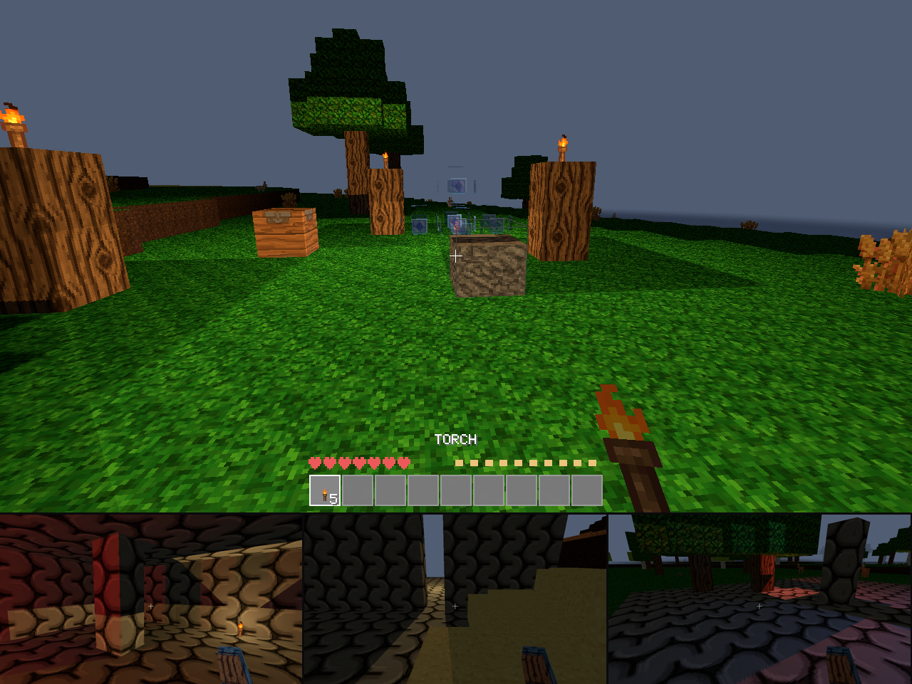

# Wildforge

A Minecraft-alpha-style voxel game written in Rust with a custom engine —
no game framework, just **wgpu** for rendering, **winit** for windowing,
**glam** for math, and **noise** for terrain. Physics is hand-rolled AABB
collision (a voxel world doesn't need a general-purpose physics engine).



## Run

```sh
cargo run --release
```

### WSL2 / WSLg note

WSLg cannot truly capture the mouse: the host Windows cursor can neither be
hidden nor warped from inside Linux ([wslg#1361](https://github.com/microsoft/wslg/issues/1361),
[wslg#240](https://github.com/microsoft/wslg/issues/240)), so under WSLg the
game falls back to stable position-delta look — the cursor stays visible and
look stops at the window edge. For proper capture, run the **native Windows
build** instead (from the repo root, so the save folder is shared):

```sh
rustup target add x86_64-pc-windows-gnu   # once; needs mingw64-gcc installed
cargo build --release --target x86_64-pc-windows-gnu
./target/x86_64-pc-windows-gnu/release/wildforge.exe   # launches on Windows
```

Sensitivity can be scaled with `WILDFORGE_SENS` (default `1.0`).

The world saves automatically to `saves/world1/` (modified chunks only,
RLE-compressed) and reloads on next launch. Delete that folder for a fresh
world with a new seed.

## Controls

| Input | Action |
|---|---|
| Mouse | Look |
| WASD / arrows | Move |
| Space | Jump / swim up |
| Ctrl | Sprint |
| Hold left click | Mine block (per-block hardness; bedrock unbreakable) |
| Right click | Place selected block (consumes from inventory) |
| Middle click | Select targeted block if in hotbar |
| 1–9 / scroll | Select hotbar slot |
| E | Open/close inventory (click to move stacks, right-click half/one) |
| Esc | Pause menu (resume / save and quit) |
| F2 | Screenshot (`screenshot-<ts>.ppm`) |
| F11 | Fullscreen |

## Modding (native, hot-reloadable)

Wildforge has a built-in mod system — vanilla content itself is the `base`
mod, registered through the same TOML pipeline external mods use
(see `base/*.toml` for the reference). **The full guide lives in
[`mods/README.md`](mods/README.md)** — and it's executable: the guide's
worked example is extracted verbatim by the test suite, loaded, and
every claim asserted, so the docs can't drift from the code.

- **Data mods** (no code): drop a folder in `mods/` with `mod.toml`
  (id/name/version/depends) and any of `blocks.toml`, `items.toml`,
  `recipes.toml` (crafting + `[[smelt]]`/`[[fuel]]`), `tags.toml`
  (item groups — recipes accept `"#base:planks"`-style tag ingredients,
  and mods can extend shared tags so a new wood's planks work in every
  plank recipe), `features.toml` (ore veins), `animals.toml` (creatures
  with box models — wildlife or wardens), `structures.toml` (worldgen
  templates + loot tables), `aliases.toml` (lossless renames), and PNG
  tiles in `textures/` (packed into the atlas at load; `@name`
  references built-in procedural tiles)
- **Script mods**: add `main.rhai` with event handlers —
  `on_world_start`, `on_tick`, `on_block_break/place` and `on_interact`
  (return `false` to cancel), `on_craft`, `on_animal_killed`,
  `on_player_respawn`, `on_mode_change`. Host API: `get_block` /
  `set_block`, `give`, `hud_message`, `play_sound`, `spawn_animal`,
  `surface_height`, `log`, and `storage_get`/`storage_set` — a per-mod
  KV store that survives hot reloads and is saved with the world.
  Scripts are sandboxed (no filesystem/network, per-event op limits).
- **Hot reload**: edit anything under `mods/` while playing — the game
  repacks the registry/atlas, remaps the live world, and recompiles scripts
  within a second (F5 forces it). A script error keeps the previous version
  running and shows the error on the MODS screen.
- **Save safety**: worlds store an id palette; removing a mod turns its
  blocks into placeholders instead of corrupting the world, and pre-mod
  (v1) worlds migrate automatically.
- **Multiplayer**: joining a host with different mods streams the
  host's data and textures to you automatically — nothing to install.
  Scripts never leave the host.
- Ships with `mods/gems` — a worked example adding deep ruby ore (tier-2
  gated), items, recipes, and a scripted milestone counter.

## Weather & seasons

The sky joined the simulation. Server-owned weather fronts roll from
clear through overcast into rain and back — and storms lean on the
wild's ire, so a WRATHFUL camp lives under thunder (with lightning
that borrows a frame of noon, and rain/storm ambience beds). A
48-day year turns through four seasons on a persistent calendar (the
inventory shows the day): foliage repaints each season, crops surge
in spring and stop in winter — unless roofed and torchlit, so
greenhouses emerge from rules you already know — berry bushes fruit
in summer and autumn, wildlife bears young in spring and never in
winter, and exposed lakes freeze over for the cold months. Snow is a
material now: snowfall settles white layers on cold ground, shovels
into throwable snowballs (harmless, knockback — aim well), packs
back into snow blocks, and melts under bright torchlight. Rain even
soothes the wild: ire decays a quarter faster while the land drinks.

## Game feel

The feedback skin, tuned to the game's quiet register: every effect
answers a player verb, then shuts up. Footsteps speak per material
(snow crunches, sand scuffs — yours, your friends', and the deer you
can't see yet), blocks burst into debris cut from their own texture,
drops pop and fly to the hotbar slot that received them, and
consecutive pickups climb a small melody. Combat hits hold the swing
for a breath and shed the mob's own colors; the anvil finally throws
its sparks and the quern visibly turns. Damage is an edge vignette
plus a two-pixel flinch pointing away from the attacker — the plan's
entire screenshake budget. The wild is audible: wind is the rain
forecast, unhunted wardens rustle before you see them, your stomach
complains before the bar empties, and calm nights chirp with
crickets that go silent as ire climbs. Walking through snow presses
real footprint blocks — trails guests can follow, saved with the
world, melting in spring. All of it is client-side presentation
(`WILDFORGE_JUICE=0` deletes the layer; the sim doesn't notice), per
the juiciness research: animation, particles, audio, persistence —
never autonomy theft.

## Glassworks

Sand falls like it should — pull the support and the column tumbles,
crushing what it lands on. It also smelts into **glass**, which
renders truly translucent, passes sunlight, and turns a glass roof
into a real greenhouse (winter crops grow under it, no torches).
Color is geology, not dyes: grind minerals to pigment at the
**quern** — verdigris and ochre from the copper and iron you already
mine, plus cobalt, cinnabar, and steel-gated manganese from three new
ore bands — then charge a **glass kiln** (the bloomery's own
firebrick stack with a different mouth) with sand and charcoal and
one powder, and fire the whole batch that color. Five stained
glasses, and the light engine plays along: **a torch behind red
glass throws only red light** — stained windows paint the night the
color of their panes.

## Iron, steel & the ruins of the takers

- **Iron** runs deep (below y 48, bronze picks required); **steel is
  a process**, not a recipe. Bake **firebrick** from stone and a
  warden's ember, raise a hollow **bloomery stack** (23 firebrick
  around a core, mouth at the base), charge it with iron and charcoal,
  and light it with another ember — half an in-game day of fire, the
  mouth glowing through the night. Rain slows an unroofed stack; a
  storm douses it. The batch pays for infrastructure: a full 8+8
  charge yields six **steel blooms**, hammered three strikes each
  into bars at a **stone anvil**. Bulk charcoal comes from the
  **clamp**: bury a log pile in earth, leave one face open, touch an
  ember to it, and tend it while it smolders. Tier 4/5 tools, swords
  (10/13), and armor (14/18 points). **Shears** clip leaves whole;
  the **excavation brush** (steel) opens the past.
- **Ruins**: the wild has argued with takers before you, and won.
  Stone circles, collapsed cabins, toppled towers on the surface;
  cellars and old forges below, marked by chimney stubs. All
  data-driven templates (`structures.toml`) — mods add ruins.
- **Archaeology**: sweep cracked masonry and packed earth with the
  brush (a slow, careful channel) for coins, seeds, worn iron tools,
  one-slot **charms** (quiet / bark / slow hunger — modest, no
  stacking), and **etched tablets** — the lost takers' last lines,
  read by right-click. Breaking a remnant destroys its find, and the
  wild charges 1 ire for opening a ruin's chest.

## Stewardship — the homestead path

The give-back half of the ire dialogue: everything renewable, and the
wild can be appeased as well as fought.

- **Saplings**: leaves drop their species' sapling (~1 in 10). Plant on
  grass or dirt; over a day or three it grows into a **real tree** of
  that wood. Planting refunds a little ire; a planted tree *maturing*
  refunds more, bypassing the daily cap — reforestation is the true
  apology. Wood is now renewable.
- **The offering stone** (cobblestone + fiber): three slots; whatever
  you leave is taken at dawn, refunding ire by what the wild values —
  its own returned materials (heartwood, embers) most, then meat and
  food. Capped per dawn; the wild takes everything either way. It glows
  faintly in the dark.
- **The bedroll** (hides + fiber, 12 uses): right-click at night to
  camp — skips to dawn, **sets your respawn to the campsite**, and
  saves. Refused while a warden is within 24 blocks; the skipped night
  still decays ire fairly.
- **Breeding**: feed a wild animal its favorite food (deer love
  berries, boars potatoes, goats wheat, grouse seeds, rabbits carrots)
  — it calms and, meeting another fed adult, bears young. Babies grow
  up over ~20 minutes and drop nothing if killed (you monster). Every
  birth soothes the wild a little. Meat is now renewable.

## Bows & armor

- **Bows**: the **hunting bow** (sticks + thornling fiber — reachable
  from your first nights) and the **warbow** (dryad living wood — the
  wild supplies the weapons you turn back on it). Hold right-click to
  draw; damage and speed scale with charge. Arrows (stick + feather +
  cobblestone → 4) are pulled from anywhere in your inventory, stick
  into terrain as recoverable drops, and are spent on flesh.
- **Armor**: **leather** (tanned hides, 7 points full) and **bronze**
  (11 points). Four slots beside the inventory grid; each point blocks
  4% of the wild's damage (cap 60%) — wardens' claws and bolts only;
  gravity remains unimpressed. Pieces wear per hit and break. Armor
  pips show above your hearts while wearing any.
- Data-driven like everything else: `bow = { damage, speed }`,
  `ammo = "arrow"`, `armor = { slot, points }` — mods can add all
  three.

## The wild answers

The world is alive, and it was never given to you. It tolerates small
takers — but the forge is different: it turns forests into charcoal,
empties the veins, cuts what was growing into what is built. The Wild
keeps its own places — night, deep woods, the dark under the ground —
and out of them it sends **wardens**: not evil, not cursed, just the
world's answer. At dawn they dissolve back into it. The more you take,
the more it sends.

- **Ire** is the difficulty system (there is no difficulty setting): a
  per-world meter raised by felling, mining, killing, and burning, and
  lowered slowly by time — and by **planting** (capped daily; mending
  is always slower than taking). Four tiers from CALM to WRATHFUL drive
  what the night sends; a fresh world's first nights are gentle because
  you haven't taken anything yet. Watch the meter in your inventory.
- **The wardens**: thornlings (carnivorous shrubs) in the grasslands
  and woods; dryads lobbing thorn bolts in provoked forests; emberkin
  and rimewisps — floating elemental wisps of cinder and frost — over
  desert and snow; gravelurks prowling every unlit cave at any hour;
  and at full wrath, the **wrathwood** — a walking carnivorous tree,
  one alive at a time, a night to remember.
- They are **territorial lurkers**: they roam the dark and attack what
  they find, but don't besiege bases. Torchlight and walls genuinely
  work. They spawn only in darkness (surface nights, caves always),
  never persist, and dissolve in daylight.
- Their drops are exclusive materials — plant fiber, living wood,
  embers (a premium fuel), frost shards, heartwood — banked for future
  crafts (bows want fiber and living wood). Provoking the wild on
  purpose is a valid, dangerous harvest.
- All data-driven: wardens are `animals.toml` entries with `hostile`,
  `attack`, `ire_min`, `movement = "float"`, `emissive`, and
  `projectile` fields. Mods can add their own.

## Light & storage

- **Real lighting**: two channels per block — sky light (full daylight
  down to the first roof, flooding sideways into cave mouths, dimming
  through water) and block light from emitters. Torches hold their
  brightness while the sky fades at dusk; sealed caves are properly
  black. Any block, including mod blocks, can glow with `light = 1..15`
  in its TOML. Edits relight the affected chunks from scratch — no
  incremental-unlighting ghosts.
- **Torches**: charcoal over a stick → 4. Floor-placed, pop off if
  their block is mined, light level 14.
- **Chests**: 8 planks (any wood mix) in a ring. 27 slots on the same
  block-entity system as the furnace; contents persist with the world,
  spill when broken, and survive mod changes by item name. Mods make
  containers with one line: `interaction = "chest"`.

## Wildlife & hunting

Every biome has its own animals — boxy, data-driven, and moddable like
everything else (`base/animals.toml`; mods add species via their own
`animals.toml`, texture packs re-skin them by tile name).

- **Species**: deer (Forest), boar (Jungle), mountain goats, grouse
  (Taiga), rabbits (Plains) and desert/snow hares. Skittish species bolt
  when you approach; boars barely care until struck.
- **Hunting**: swing at an animal in your crosshair (left click).
  **Swords** — wood, stone, copper, bronze (2 material over a stick) —
  hit far harder than tools; every swing costs a little hunger and
  durability. Kills drop raw meat plus hides or feathers.
- **Cooking**: every meat roasts in the furnace (cooked is strictly
  better), hides tan into **leather**, and any meat + potato + mushroom
  crafts a **hearty stew**. Meat wakes the dormant **Protein** nutrition
  track — a fifth +2-heart max-health bonus for a truly balanced diet.
- **Wildlife is persistent**: animals are seeded once per chunk as the
  world generates, saved with the world, and never despawn. Overhunt an
  area and it stays empty — wildlife recovers slowly, spawning well away
  from you. There's no breeding yet; hunting pressure is real.
- Mods get an `on_animal_killed` event and a `spawn_animal` host call.

## Texture packs

Drop-in re-skins, no recompiling and no mod required. Design doc:
`docs/texture-packs-plan.md`.

- **Format**: a folder in `packs/` with individual PNGs named by tile —
  `packs/<id>/tiles/stone.png`, `grass_top.png`, … (the same names mod
  TOML references as `@stone`). Mod art is addressable too:
  `tiles/gems/ruby_ore.png` re-skins the gems mod's ruby ore. Any
  per-tile resolution; tiles you don't include keep their default art.
  Optional `pack.toml` supplies a display name and description.
- **Selecting**: TEXTURE PACKS on the title screen lists every pack;
  click to switch instantly. The choice persists in `config.txt`
  (`WILDFORGE_PACK=<id>` overrides it for a run without saving).
- **Live editing**: repaint a PNG while the game runs and the world
  re-skins within a second — same hot-reload loop as mods.
- **Start from a template**: `WILDFORGE_EXPORT_TILES=packs/mytheme`
  dumps every named tile (built-ins plus loaded mods) as a
  correctly-named PNG with a stub `pack.toml` — repaint what you want,
  delete the rest. `WILDFORGE_EXPORT_ATLAS=file.png` still exports the
  whole sheet, and a full `assets/atlas.png` replacement still works as
  the base layer under packs.
- Packs layer **over** mod textures: an explicit pack choice wins, but
  only for tiles it ships. The **default look is `gemini`** — a full
  AI-generated set (111 tiles) compiled into the binary, so a bare
  executable ships with it and fresh installs load it automatically.
  Prefer the classic zero-asset look? Pick NONE — PROCEDURAL on the
  TEXTURE PACKS screen. A `packs/gemini/` folder on disk overrides the
  built-in copy tile-by-tile (and hot-reloads), and `packs/dusk` ships
  as a worked example of a folder pack. The set was made with
  `tools/gen_texture_pack.py`, which turns Gemini image generation into
  pack PNGs (crop, box downscale, palette quantize, seam blending for
  ground tiles, magenta chroma-key for sprites, bottom-aligned plants).
  Regenerating needs an API key in `~/.gemini_key`; the shipped PNGs
  don't.

## Item browser & creative mode

- **Item browser** (native NEI/JEI): a searchable panel docked beside the
  inventory, crafting, and furnace screens listing every item — including
  everything mods add, automatically. Click an item for its crafting and
  smelting recipes (tag ingredients cycle through their members) or the
  USES tab (recipes, smelting inputs, and fuel roles). In creative mode
  the browser is the palette: click grabs a stack, right-click one.
- **Creative mode**: choose Survival or Creative at world creation, or
  toggle anytime from the pause menu (stored in `world.toml`). Creative
  means invulnerability (survival HUD hidden), instant breaking with no
  drops or tool rules, placement that never consumes, and **flight** —
  double-tap space, then space/ctrl to rise and sink.

## Menus, worlds & settings

- **Title screen**: list of worlds under `saves/` with their seeds — play any,
  create a **new world with a random seed**, or delete one (with confirmation)
- **Settings** (from title or pause menu): master **volume**, mouse
  sensitivity, render distance, and FOV — adjusted with sliders, applied live,
  persisted to `config.txt`
- **Pause menu**: resume, settings, save & quit to title
- **Sound**: procedurally synthesized effects (no audio files) — per-material
  block breaking, placing, item pickup, crafting, damage, splashes, UI clicks
- Dev/headless: `WILDFORGE_WORLD=name` skips the title screen

## Survival

- **Mining**: hold to break with per-block times and a growing crack overlay;
  blocks drop item entities (grass → dirt, stone → cobblestone, leaves → nothing)
  that bob, spin, and magnetize into your inventory
- **Inventory**: 9 hotbar + 27 storage slots, 64-per-stack, full drag-and-drop
  inventory screen (E); placing consumes items
- **Health**: base 7 hearts, fall damage (beyond 3 blocks), drowning with
  air bubbles; **regeneration costs food** (hunger ≥ 85%)
- **Hunger & nutrition**: activity drains hunger (sprinting/jumping/mining
  cost extra); below 30% you can't sprint; starving weakens you to 1 heart.
  Foods feed five nutrition tracks (grain, vegetable, fruit, fungi, protein
  — protein awaits animals); every track kept above 40 adds **+1 max
  heart** (up to 11 today), so a diverse diet literally makes you tougher.
  Nutrition panel lives in the inventory screen
- **Farming**: craft a hoe (any tier), till dirt into farmland, plant
  wheat seeds/carrots/potatoes; crops grow through staged sprites via
  random ticks. Wild food is biome-tied: plains wheat, forest carrots and
  regrowing berry bushes, taiga potatoes and mushrooms, desert cactus
  fruit (right-click cacti), jungle fruit bushes. Furnace bakes potatoes,
  roasts mushrooms, and bread/forest stew reward cooking; food data
  (`food = { hunger, nutrition = {...} }`) is fully moddable
- **Player persistence**: position, health, hunger, nutrition, and
  inventory now save with the world (`player.toml`)
- **Death**: your inventory scatters as drops; respawn at the world spawn
- **HUD**: hotbar with icons/counts, hearts, air bubbles, item name popup,
  damage vignette — all drawn with a procedural 5×7 pixel font (zero assets)

## Tools & Crafting

- **Items**: blocks, sticks, and wood/stone pickaxes, axes, and shovels with
  Minecraft-alpha durability (59/131 uses, shown as a colored bar); tools
  don't stack
- **Tool rules**: matching tools mine 4× (wood) / 8× (stone) faster;
  stone and cobblestone drop nothing without a pickaxe
- **Crafting**: 2×2 grid in the inventory (E); craft a **crafting table**
  (2×2 planks) and right-click it placed in the world for the 3×3 grid.
  Shaped recipes match at any grid offset and mirrored:
  - log → 4 planks; 2 planks (stacked) → 4 sticks; 2×2 planks → crafting table
  - pickaxe: 3 material across the top + 2 sticks down the middle (3×3)
  - axe: 2×3 head-and-shaft shape, either chirality (3×3)
  - shovel: 1 material over 2 sticks (3×3)
  - materials: planks → wood tier, cobblestone → stone tier

- **Smelting**: craft a furnace (8 cobblestone); it holds input, fuel, and
  output with live flame/progress indicators, keeps working while you walk
  away, and its state persists in the save. Fuels: charcoal > logs >
  planks > sticks. Smelt raw ores into ingots and any log into charcoal.
- **The bronze age**: copper ore (common, y8–72) and tin ore (rarer,
  y8–56) smelt into ingots; 3 copper + 1 tin craft into bronze blend,
  which smelts into bronze ingots. Copper tools (tier 2, 9×, 160 uses)
  edge out stone; bronze tools (tier 3, 12×, 225 uses) are the prize.
  Tools carry **tiers** — blocks can require a minimum tier to drop
  (rubies in the example mod need tier 2+).

The natural progression: punch a tree → planks → sticks + crafting table →
wood pickaxe → mine stone → cobblestone + furnace → smelt copper and tin →
bronze tools.

Dev cheat: `WILDFORGE_GIVE=1` starts with some items for testing.

## Features

- Infinite procedural **3D terrain** (Caves & Cliffs style): a
  lattice-interpolated density field with spline-shaped geography —
  continentalness/erosion/ridges noises drive ocean basins, plains,
  plateaus, and mountain ranges up to y≈230 with real overhangs and cliff
  lips (16×16×256 chunks, sea level 64, bedrock floor); frustum-culled
  rendering; design in `docs/terrain-v2-plan.md`
- Layered noise caves: big "cheese" caverns deep down plus winding
  "spaghetti" tunnels whose entrances taper near the surface
- Slope- and altitude-aware surfacing: steep faces expose bare stone,
  peaks above y≈170 carry snow caps, underwater floors are sand/gravel
- **Eight biomes** by nearest-centroid matching in 5D climate space
  (temperature, humidity, continentalness, erosion, ridges) — forest,
  plains, desert (sand + cacti), jungle (dense giant canopies), scrubland
  (patchy sand/grass + shrubs), taiga (conifers), arctic (snow cover,
  frozen ocean ice), and mountains (bare stone, snow caps) — each with its
  own surfaces, vegetation shapes, and densities; **five wood families**
  (oak, birch with flecked white bark, dark spruce, vivid jungle, olive
  acacia) grow per biome with distinct bark/leaf/ring textures, forests
  mix oak and birch, and every log crafts into its own colored planks —
  all plank types are interchangeable (and mixable) in recipes via
  ingredient tags; biome placement
  correlates with terrain shape because both read the same noise fields;
  the current biome shows in the window title
- Chunk streaming with per-frame generation/meshing budgets, nearest-first
- Face-culled chunk meshing with per-vertex ambient occlusion and
  Minecraft-style directional face shading (with anisotropy-fixing quad flips)
- Procedurally generated texture atlas (32×32 tiles by default,
  `WILDFORGE_TILE_PX=16|32|64|128`): tileable multi-octave value noise,
  voronoi cobblestone/gravel, board-and-nail planks, growth-ring logs,
  turf overhangs — zero asset files
- **Texture packs**: drop a square `assets/atlas.png` (side a multiple of 16)
  and it replaces the procedural atlas — no recompile. Export the procedural
  atlas as a starting template with `WILDFORGE_EXPORT_ATLAS=atlas.png`
- **Flowing water** (Minecraft-style): sources spread up to 7 blocks with
  decreasing levels and rendered heights, fall over ledges as waterfalls,
  cascade downhill, stay one block deep, and recede when cut off (5 Hz fluid
  ticks); jump while swimming against a ledge to hop out of water
- Translucent water with level-based surface heights, underwater tint,
  swimming physics
- Day/night cycle (10 min) with sky, fog, and light dimming
- AABB player physics: gravity, jumping, sprinting, axis-resolved collision
- DDA voxel raycast for block targeting with wireframe outline + crosshair
- World persistence via RLE-encoded chunk files

## Multiplayer

One binary, no server jar, ever:

- **Host**: pause menu → **OPEN TO FRIENDS**. Your world announces on
  the LAN and accepts direct connections (QUIC on port 27431 —
  encrypted transport, pure Rust). A **headless dedicated host** is the
  same executable: `wildforge --server <world>`.
- **Join**: title screen → **JOIN GAME** — LAN-discovered worlds
  listed live, or type an IP. On join the host streams its palette
  and, if your mods differ, **its entire mods folder** — you play with
  the host's content, no installing anything (scripts never leave the
  host; your texture pack stays yours).
- **Server-authoritative**: guests send requests; the host validates
  (reach, rate) and applies them through the same code paths local
  play uses, echoing results to everyone. Chunks stream in the save
  format; mobs, bolts, and players snapshot over unreliable datagrams
  and render through interpolation, so everything glides instead of
  stuttering. Shared chests and furnaces use transactional clicks —
  full cursor semantics, and a worn tool stays exactly as worn.
- **Shared world, shared ire** — one meter for the whole camp; your
  friend's clearcut is your Wrathful night. Mob AI hunts the nearest
  player; drops from your kills and digs arrive in *your* inventory.
- **The camp sleeps together**: dawn requires every present player in
  a bedroll. Chat with T. Fellow players render as boxy humans with
  name tags — and you see your own hand in first person: the held
  block or tool swings when you mine, strike, and place.
- Under it all: the **sim/client split** — `server::Server` steps the
  world at a fixed 30 Hz whether one player or eight are in it.
  Singleplayer is just a server with one local player.

## Architecture

| Module | Role |
|---|---|
| `main.rs` | winit event loop, input, chunk streaming, day/night, HUD title |
| `world.rs` | chunk map, block get/set, dirty tracking, save/load |
| `worldgen.rs` | Perlin heightmap, caves, trees |
| `chunk.rs` | 16×128×16 block storage |
| `mesher.rs` | visible-face extraction, AO, opaque + water meshes |
| `renderer.rs` | wgpu device/surface, pipelines, per-chunk GPU buffers |
| `shader.wgsl` | chunk/water/line shaders, fog, daylight |
| `physics.rs` | player AABB movement & collision |
| `raycast.rs` | Amanatides–Woo voxel traversal |
| `atlas.rs` | procedural block textures |
| `camera.rs` | first-person camera |

Tests (`cargo test`) cover worldgen determinism, save/load round-trips,
raycast targeting, and physics (landing, walls, jump height).
