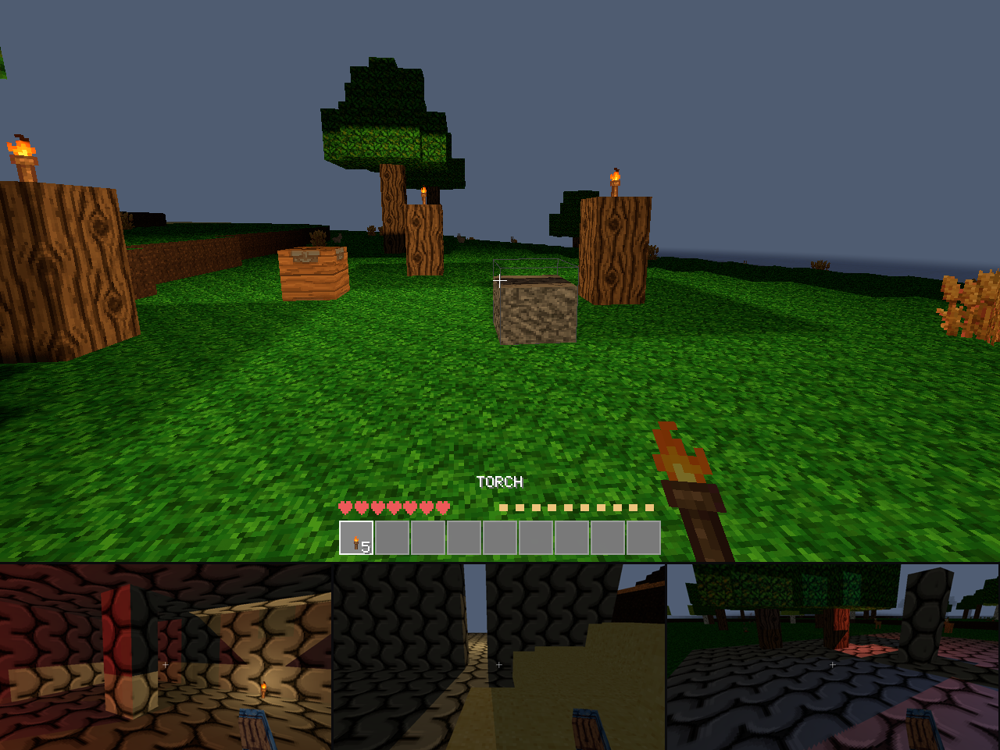

# Wildforge

A Minecraft-alpha-style voxel game written in Rust on a custom engine,
available under the [MIT license](LICENSE).
There's no game framework under it: **wgpu** draws, **winit** handles the
window, **glam** does the maths, **noise** makes the terrain. Collision is
hand-rolled AABB, because a voxel world doesn't need a general-purpose
physics engine.



## Run

```sh
cargo run --release
```

### Prerequisites and development

Wildforge supports native Linux and Windows. The renderer enables
Vulkan/GLES on Linux and Direct3D 12 on Windows; use a driver and adapter that
supports one of those APIs. macOS/Metal is not currently a supported build
target. WSLg runs with the mouse-capture limitation described below.

The minimum Rust version is 1.95. A checkout pins Rust 1.96 with Rustfmt and
Clippy through `rust-toolchain.toml`, so [rustup](https://rustup.rs/) selects
the tested toolchain automatically. Install the optional local advisory
runner with `cargo install cargo-deny --locked`; CI supplies it independently.

On Ubuntu 24.04/Debian, install the native audio/build discovery packages:

```sh
sudo apt-get install libasound2-dev pkg-config
```

The repository checks are:

```sh
cargo fmt --all -- --check
cargo clippy --locked --all-targets -- -D warnings
cargo test --locked --all-targets
cargo build --locked --release
cargo deny check advisories
```

For quick feedback, CI runs non-agent tests separately:

```sh
cargo test --locked --all-targets -- --skip tests::agent::
```

The ten end-to-end QUIC agent scenarios retain their own serial lane:

```sh
cargo test --locked tests::agent:: -- --test-threads=1
```

They completed in 22.01 seconds on the 2026-08-03 review machine and have a
30-minute cold-run CI timeout so compilation cannot self-cancel the scenarios.
The scenarios themselves should remain comfortably below five minutes; the
fast lane has the same runtime budget, and crossing either is treated as a
performance regression.

## Architecture

Wildforge is one Cargo package with a deliberately small public surface: the
binary hands startup to the library, and the library owns the custom engine.
The internal dependency direction is:

```text
platform/app -> client Game -> Server simulation -> World/content
                         |             |
                         v             v
                      renderer      networking adapter
```

- `game/` owns client orchestration and its input, UI, survival, interaction,
  presentation, multiplayer, and content-runtime state.
- `server.rs` is the fixed-step authority shared by solo play, windowed hosts,
  and the dedicated server. Guests consume snapshots and send requests; they
  do not generate or save authoritative chunks.
- `world/` owns spatial state and the block-mutation side effects for chunks,
  persistence, machines, ecology, fluids, lighting, and the calendar.
- `renderer/` consumes frame data and meshes. GPU state and cosmetic random
  streams never feed back into simulation.
- `net.rs` owns wire values; `mp.rs` translates guest requests into the same
  authoritative World operations used by local play.
- `atlas/`, `registry.rs`, and `script.rs` form the content pipeline, using
  stable names at persistence and synchronization boundaries.
- `arcane.rs` owns the conserved Current ledger. `arcane_geography.rs` and
  `arcane_ecology.rs` own its finite planetary distribution and living sites;
  `discovery.rs`, `implements.rs`, `workings.rs`, `alchemy.rs`, and `dross.rs`
  own the player-facing practice. Their `world/` counterparts apply physical
  effects through the same authoritative World transactions as mundane play.
  `magic_qualification.rs` is an offline fail-closed audit; it is not a second
  simulation or a survival-client endpoint.

The rationale, compatibility constraints, and two-pass refactor record live
in [the modularization plan](docs/modularization-plan.md). A separate reusable
engine crate is intentionally deferred until there is a second real consumer.

### WSL2 / WSLg note

WSLg cannot truly capture the mouse: the host Windows cursor can neither be
hidden nor warped from inside Linux ([wslg#1361](https://github.com/microsoft/wslg/issues/1361),
[wslg#240](https://github.com/microsoft/wslg/issues/240)), so under WSLg the
game falls back to stable position-delta look — the cursor stays visible and
look stops at the window edge. For proper capture, build and run the **native
Windows build** instead:

```sh
rustup target add x86_64-pc-windows-gnu   # once; needs mingw64-gcc installed
cargo build --release --target x86_64-pc-windows-gnu
mkdir -p /mnt/c/Games/Wildforge
cp target/x86_64-pc-windows-gnu/release/wildforge.exe /mnt/c/Games/Wildforge/
cp -a mods /mnt/c/Games/Wildforge/
cd /mnt/c/Games/Wildforge
./wildforge.exe
```

Do not run the native executable with its working directory inside
`\\wsl.localhost`/`\\wsl$`. Windows then streams and saves chunks through the
WSL network-filesystem bridge, which is dramatically slower than NTFS and can
deny atomic save-file replacement. The base game and textures are embedded in
the executable; copy `mods/` beside it to retain the repository's optional
content. Saves then live in `C:\Games\Wildforge\saves` and remain reachable
from WSL at `/mnt/c/Games/Wildforge/saves`.

Graphical performance qualification likewise uses that native Windows build,
not WSL's `llvmpipe` software renderer. Wildforge rejects CPU rendering
adapters at startup rather than reporting their timings as game performance.

Sensitivity can be scaled with `WILDFORGE_SENS` (default `1.0`).

Worlds save under `saves/<name>/` and reload from the title screen. Immutable
planet genesis is written once; ordinary saves rewrite only mutable planetary
state and modified chunks.

## One finite planet

Every world is one closed cube-sphere: six `8192 x 8192` surface faces and a
finite address space of 103,079,215,104 possible block cells. Walking across a
face edge is ordinary travel, bearings remain continuous, and a full
east/west circuit returns home after 32,768 surface blocks. Most voxel chunks
do not exist yet; a complete global atlas establishes continents, geology,
climate, drainage, biomes, countries, hearts, water, and mineral sites before
the qualified homeland is prepared, then terrain materializes lazily as
people travel.

Create World opens an explicit seed screen: type any `u32` seed or roll one,
then watch the named atlas and homeland stages. Cancellation removes the
hidden temporary world rather than publishing a partial save. The title list
shows seed, generator version, atlas version, content hash, and readiness;
incompatible flat/old/corrupt folders are reported instead of silently
reinterpreted. Entering an existing world is also asynchronous: play begins
only after the persisted common homeland and that player's exact 3x3 safety
region are resident.

The planet is finite but not eagerly built. A 5x5 common homeland is prepared
once, wider render-distance rings stream nearest-first, and solo, windowed
host, dedicated host, graphical guest, and headless agent use the same entry
contract. Guests cannot move, take damage, appear in the active roster, or
affect simulation until their exact entry manifest is decoded and accepted.

## Controls

| Input | Action |
|---|---|
| Mouse | Look |
| WASD / arrows | Move |
| Space | Jump / swim up |
| Ctrl | Sprint |
| Hold left click | Mine block (per-block hardness; bedrock unbreakable) |
| Hold right click | Contextual use: place a block, work an apparatus, aim a tuning lens, apply a preparation, or channel the selected wand working |
| Hold right click with brush | Excavate a remnant, or sift ordinary stone/earth for regional salvage |
| Middle click | Select targeted block if in hotbar |
| 1–9 / scroll | Select hotbar slot |
| E | Open/close inventory (click to move stacks, right-click half/one) |
| Esc | Pause menu (resume / save and quit) |
| F2 | Screenshot (`screenshot-<ts>.ppm`) |
| F11 | Fullscreen |

## Modding (native, hot-reloadable)

Wildforge has a built-in mod system — vanilla content itself is the `base`
mod, registered through the same TOML pipeline external mods use
(see `base/*.toml` for the reference). **The full guide lives in
[`mods/README.md`](mods/README.md)** — and it's executable: the guide's
worked example is extracted verbatim by the test suite, loaded, and
every claim asserted, so the docs can't drift from the code.

- **Data mods** (no code): drop a folder in `mods/` with `mod.toml`
  (id/name/version/depends) and any of `blocks.toml`, `items.toml`,
  `recipes.toml` (crafting + `[[smelt]]`/`[[fuel]]`), `tags.toml`
  (item groups — recipes accept `"#base:planks"`-style tag ingredients,
  and mods can extend shared tags so a new wood's planks work in every
  plank recipe), `features.toml` (ore veins), `animals.toml` (creatures
  with box models — wildlife or wardens), `structures.toml` (worldgen
  templates + loot tables), `aliases.toml` (lossless renames), and PNG
  tiles in `textures/` (packed into the atlas at load; `@name`
  references built-in procedural tiles)
- **Script mods**: add `main.rhai` with event handlers —
  `on_world_start`, `on_tick`, `on_block_break/place` and `on_interact`
  (return `false` to cancel), `on_craft`, `on_animal_killed`,
  `on_player_respawn`, `on_mode_change`. Host API: `get_block` /
  `set_block`, `give`, `hud_message`, `play_sound`, `spawn_animal`,
  `surface_height`, `log`, and `storage_get`/`storage_set` — a per-mod
  KV store that survives hot reloads and is saved with the world.
  Scripts are sandboxed (no filesystem/network, per-event op limits).
- **Hot reload**: edit anything under `mods/` while playing — the game
  repacks the registry/atlas, remaps the live world, and recompiles scripts
  within a second (F5 forces it). A script error keeps the previous version
  running and shows the error on the MODS screen.
- **Save safety**: worlds store an id palette; removing a mod turns its
  blocks into placeholders instead of corrupting the world, and pre-mod
  (v1) worlds migrate automatically.
- **Multiplayer**: joining a host with different mods streams the
  host's data and textures to you automatically — nothing to install.
  Scripts never leave the host. Other players appear as full-height
  characters with their **chosen appearance** (APPEARANCE on the
  title or pause menu: skin tone, hair, shirt, trousers — palette
  swatches with a live preview), walking with a real gait and
  holding what they hold. The default look is deliberately
  gender-neutral; identity is yours to pick.
- Ships with `mods/gems` — a worked example adding deep ruby ore (tier-2
  gated), items, recipes, and a scripted milestone counter.

## A finite magical practice

Magic belongs to the same planet as ore, rain, food, and politics. The
**Current** is finite: it lies deep, moves through geography, gathers at
confluences, wells, stills, echoes, heartshadows, and wakes, and can become
bound in living things, minerals, tools, preparations, waste, and scars. A
charge is always moved from a named reservoir. Magic cannot conjure or
transmute ordinary matter, teleport people or cargo, erase water/material
costs, or turn a local instrument into a global scanner.

The path begins with signs rather than a spell menu. Ruins contain old charms
and clues from earlier makers, while redundant overland remnants provide a
solo construction route. Make a tuning lens and field ledger, take qualitative
observations, run repeatable physical experiments, copy selected records into
a shared folio, and decide whether to include the location. Recipes are public
in the item browser; a ruin charm is a desirable head start, never a unique
gate.

Magical plants and minerals obey real habitats. Rainbell wants a wet margin,
Hushwood an old forest, Stormvine actual warm storms, and desert Nightglass a
cool dark niche. Wellglass grows only from a seed with room and enough local
Current. Choirstone, Still Salt, Wake Iron, and Echo Slate are regionally
finite geology. Harvest, cultivation, fire, water, nutrients, and collapse all
close the same planetary ledgers.

Binding frames combine physical bodies, reservoirs, foci, and bindings into
wands with different tradeoffs. Charge vessels, adjacent conductors, and
containment blocks move finite Current; long-distance charge travels as cargo.
The three charms are craftable, charged implements. Eight wand workings and
four constructed rites perform bounded process changes, and an apothecary's
mortar, basin, alembic, and filter stand make eight preparations from real
solvents, ingredients, heat, time, vessels, and residues.

Carelessness produces **Dross**. Dross is not Ire: Dross is conserved magical
waste in air, water, soil, organisms, containers, apparatus, or scars; Ire is
the Wild's relational memory of attributed harm and tending. A place warns
through Clear, Trace, Strained, Seep, Scar, and Breach Risk cues before severe
effects. Scarring is consequential but recoverable: stop the source, contain
mobile waste, excavate manifestations, filter or sequester it, restore habitat,
and let viable hearts/ecologies slowly reorder it. The waste itself changes
Ire only when it causes actual ecological harm.

Dedicated hosts remain authoritative. Players and agents receive local,
qualitative signs and physical records—not exact hidden Current, global Dross
maps, private provenance, or operator audits. The final design and evidence
live in [the magic sequence](docs/magic-sequence.md) and
[qualification record](docs/magic-qualification-implementation.md).

### Magic operator diagnostics

These commands open a stopped/offline world and print exact administrative
state. Keep their output private from ordinary players:

```sh
wildforge --magic-qualification <world> --mods mods --output magic-report.txt
wildforge --arcane-audit <world>
wildforge --arcane-geography-audit <world>
wildforge --arcane-geography-export <world> --output <output-directory>
wildforge --arcane-ecology-audit <world>
wildforge --discovery-audit <world>
wildforge --implements-audit <world>
wildforge --workings-audit <world>
wildforge --alchemy-audit <world>
wildforge --arcane-atlas <world> --layer dross --output <output-directory>
```

Post-creation base magic is installed by the versioned world reopen/migration.
New mod sites, organisms, crystals, and finite minerals require an explicit
`untouched_host_only` policy; deterministic retrogen adds only empty untouched
candidates and never rewrites worked ground or invents custody.

## Mechanization — the machine-tool age

Power is a boolean with a rate, never a number with a cable. The
**water wheel** turns only on *live* water — a weir lip, a spring
race, a channel you built; standing pools turn nothing — and carries
a few seconds of flywheel momentum because a race's flow flickers as
it equalizes. The **windmill sail** wants altitude (y≥90) and open
sky, and the weather sets its rate: the only machine that loves a
storm. What a source drives is decided by **shafts** — real blocks:
axles carry straight through, framed crown gears turn corners, and
wooden millwork refuses past 12 blocks until a bearing-fitted shaft
forgives the friction. Off the line hang the capital siblings of
hand processes, every one hand-loaded and readable (click to rest
work, bare hand to take it — no machine GUIs, ever): the
**millstone** grinds sixteen-item loads unattended, the **sawmill**
cuts six planks a log to the hand's four, and the **helve hammer**
works any adjacent anvil at half a smith's pace and none of his
attention.

Then the arc's soul, the true story of the industrial revolution —
**precision begets precision**. The **crude lathe** turns soft metal
at sloppy tolerance: copper into screws, bronze into the
**leadscrew**. That's enough, because a lathe *with* a leadscrew
cuts truer threads than any screw in itself: the **iron lathe** it
unlocks turns iron shafts, cuts gears from plate, grinds bearings
from steel — and tolerance is a property of the *machine*, so parts
made on the wrong lathe simply can't be made. The screw's first
gift is workholding: precision machines refuse to cut without a
**vice** in reach. Plate is hammered at the anvil, never turned —
which means the helve makes it while you're elsewhere. The **boring
mill** alone bores a true **cylinder** (Wilkinson before Watt), and
its first customer is the **pump**: each powered stroke lifts one
conserved water cell out of a flooded shaft, so deep mining's
drainage problem is real and solvable. Then power leaves the river:
**firebox + boiler + engine** burn banked coal and drink real water
cells to drive shafts harder than any wheel, anywhere you can carry
fuel — coal country becomes power country. And electricity lands
where history put it, *after* machining, because a **generator** is
a machined object: magnet (hammered from neodymium after the
**separator** splits rare-earth powder — the cerium majority
polishes glass, an honest luxury sink), lathe-turned shaft,
bearings, copper windings. Its field lights **arc lamps** — white,
cobalt blue, cinnabar red, burning only while the shaft turns — and
runs the **electric quern** where geography and coal both said no.
Design and divergence notes: `docs/mechanization-plan.md`.

## The land remembers

Ire is no longer one number for the whole world. The wild keeps a
**regional ledger**: every 256-block cell of country has its own
standing, charged by what you take there and credited by what you tend
there, fading over days. Walk from your mended valley into a stripped
one and the night ambience changes register.

Aggrieved country sends **watchers**. These are wardens that never
hunt; they stand at the treeline and look. Mend the land and they
dissolve without a word. Ignore one long enough and it becomes
everything a warden is.

The wild also asks for things by season at the offering stone: seeds in
spring, water in summer, first fruits in autumn, food in winter. A
wanted offering counts double. Give a cell a full blessed season and it
replants itself, seeding saplings of the local wood on ground no player
has touched.

Woodland has its own answer to salt country. Dig **clay**, fire
**crocks**, pickle vegetables, or cure raw cuts on a **smoking rack**
over a live torch: four minutes of smoke buys meat that keeps for an
hour.

## Trade & travel

The map got wider and the pack got heavier, so animals carry it. Feed a
tamed animal enough meals and it accepts you. Clip on a **lead** (leather
strips) and it follows at heel with twelve blocks of slack before it
snaps free, then buckle on **saddlebags** for twelve more slots.

**Boats** launch onto any water and you ride them; jump to dismount.
They're vehicles, born tame, and they float properly.

**Signs** hold three lines on a real signboard. **Waystones** are
obelisks you attune to by touch and read for bearings. There is no
teleportation and never will be: they orient you, and then you walk.

A **market stall** is a multiblock, a counter flanked by two-tall log
posts under a three-wide awning, and it trades while it stands. Stock
goods, set any item stack as the price (barter, no coin), and the till
collects while you're away. Guests buy over the wire; the owner restocks
by identity.

## The economy of scarcity

Nobody pays a miner if everyone can dig all the gold they want, so the
ground deals in **regions**. Kimberlite pipes run about 2.4 km apart,
geodes and batholith provinces band the map, tin hides as chance traces
in ordinary stone, and **halite** seams make salt country somewhere
worth knowing.

The **prospector's pick** reads the country when you strike rock with
it: granite bearings, volcanic ground, blue ground, hollow rings, each
with a distance and a direction. A **survey cairn** publishes that
reading to anyone who walks up. Knowledge becomes an artifact, and it
costs the surveyor their pick.

Food spoils. Freshness rides every perishable stack, runs at a quarter
speed in a proper **cellar** (dark, no skylight), and stretches further
with **salting**, smoking or pickling. That is what makes somebody's
salt route matter.

The workshop is the capital. A **forge** (firebrick stack, chimney,
anvil in reach) batch-smelts through the rain that douses an open
stack, and a kiln with a chimney becomes a **glassworks** whose draft
doubles what every fuel fires. Nomadic play stays valid, and hungry.
Settling is the faster path, never the only one.

## Finite materials

Ore is not merely rare: every planet has a persisted manifest of bounded
deposits, and every materialized ore block reserves exact mass from it. Mining,
crafting, smelting, placing, machines, containers, cargo, and item entities
transfer tracked material between named compartments. Fuel and process loss
are explicit sinks; a bad content recipe is rejected instead of minting or
deleting metal.

Durability does not erase a tool's metal. A broken tracked tool becomes a
damaged object: primitive work recovers 75%, a proper forge recovers 90%, and
clean machine dismantling recovers 95%. The forge banks fractional stock until
it can return an ordinary recipe-usable ingot or powder, so integer rounding
cannot create material. Scale, slag, and tailings remain secondary material;
advanced processes can recover some of them.

Drops still despawn for performance, and lava still ruins things, but tracked
mass moves into one bounded regional salvage pool rather than vanishing. Hold
the excavation brush on ordinary stone or earth to sift that country at the
primitive 75% yield. The pool intentionally stores no item coordinates, so it
cannot become a supernatural lost-property locator. Death drops, animal cargo,
machines (including their inventories), guests, and dedicated servers all use
the same authoritative accounting paths.

Operators can reconcile a saved planet without loading every voxel chunk:

```sh
wildforge --material-audit saves/world1
```

The report is aggregate-only: original and remaining virgin mass, underground,
inventory/entity, placed, secondary, consumed/lost, external additions, and
the unexplained delta for each material. It also checks bronze bootstrap,
critical-site redundancy, flux access, treasure sites, and a pessimistic count
of complete technology arcs. Exit status is 0 only when conservation and
planet qualification both pass, 1 for a gap/failure (or unreadable data), and
2 for incorrect command usage. Exact deposit coordinates never appear in
ordinary player notices.

The crash-safe files live beside the world as `materials.wfm` and the bounded
`materials.wfm.log`; their previous compacted copies are
`materials.wfm.bak` and `materials.wfm.log.bak`. A pending transaction is
replayed exactly once after an interrupted write. Corrupt accounting is
refused and reported—Wildforge never “repairs” a gap by inventing replacement
mass.

## Weather & seasons

The sky is part of the planetary simulation. Server-owned weather cells
advect coherent fronts across the globe, so one country can be clear while
another is under rain. Vapor and cloud water are conserved, mountains wring
out windward air, and storms may lean on local ire without creating moisture.
Lightning borrows a frame of noon; rain and storm have their own ambience
beds.

The calendar is persistent and the inventory shows the local season, weather,
temperature, and wind. Axial tilt gives the hemispheres opposite seasons;
foliage, crops, wildlife, snow, ice, fire, machines, sky, and ambience all read
their local planetary conditions. The supernatural Long Winter still chills
and suppresses growth everywhere without pretending the orbit stopped.

Snow is a material. Snowfall settles white layers on cold ground,
shovels into throwable snowballs (harmless, but they knock you about),
packs back into snow blocks, and melts under bright torchlight. Rain
soothes the wild too: ire decays a quarter faster while the land
drinks.

## Finite water

Water is volume rather than paint. Every cell holds real units that
fall, spread and settle. Breach a pond bank and the pond genuinely
lowers. Break a natural dam and it drains completely, every last unit
going over the edge instead of stranding a lip. Dig a channel to the
sea and it fills, because the sea is vast rather than because the game
cheats.

Connected bodies **level through their junctions**. Link two pools
below the waterline and they equalise, being communicating vessels.
There's no infinite-source trick anywhere; the oceans are just very
large. An iron **bucket** carries a full cell, and films refuse, so you
can't mint water out of puddles.

The finite planet knows its water before anyone visits it. Rain and snowmelt
accumulate through seam-crossing watersheds into named tributaries, descending
rivers, through-flow lakes, terminal salt lakes, estuaries, wetlands, and one
dominant world ocean. Channels widen with discharge, dry-country headwaters
may be empty gullies between wet seasons, and fish read the actual depth,
flow, temperature, and salinity. Generating a distant shore reveals its
budgeted water and recorded rounding residual; it does not create a new sea.

The year moves it too, without a hidden faucet or drain. Evaporation moves
fresh water into atmospheric vapor and leaves dissolved salt behind; rain and
snow debit clouds, fill soil, recharge aquifers, run down catchments, and raise
their receiving basins. Springs weaken under pumping and recover with
recharge. Frozen water thaws back into the same audited cycle, while sea ice
rejects most of its salt.

Fresh, brackish, and salt water remain distinct in voxels and buckets. Pumps,
flooded mines, boilers, and exhausted steam transfer exact water and salt
rather than minting or deleting them. Saved chunks own the water they reveal,
and unvisited country continues through the same server-owned coarse cycle.
Operators can reconcile every reservoir with `wildforge --water-audit
<world>`.

To validate or deliberately rebuild a world's qualified entry region without
admitting a player, then close both conservation ledgers, run:

```sh
wildforge --validate-entry saves/world1
```

The command exits nonzero for an incompatible atlas, failed preparation/save,
water or salt drift, or a material-accounting/progression failure.

## Minerals & geology

The ground earns its keep. Uniform stone gave way to **rock
families**: a sedimentary stack (sandstone over limestone over
shale) rides on basement stone, granite plutons punch up through the
bedding, and their contact halos bake marble, slate, and quartzite —
all real blocks, so the strata read in every cliff and every one
dresses into bricks. **Where you dig finally matters**: coal seams
lens through shale, gold flecks visible quartz veins and nothing
else, galena hides in cooked limestone, chromite runs the deep
basalt, and **diamonds exist only in kimberlite pipes** — rare
carrot-shaped intrusions, mostly blind, sometimes betrayed by a
blue-ground stain in the soil. **Volcanoes** rise on deterministic
ground: basalt cones threaded with carbonatite dikes (the rare-earth
host), sulfur-crusted flanks, and a crater pooling **real finite
lava** — the second fluid, on the water engine's rails: it creeps,
it burns, it hardens to obsidian or basalt where water meets it, and
it rides the same iron bucket. Underneath it all, sealed magma
pockets wait to be mined into.

The land itself follows natural law now: a static **plate map**
shapes the continents — fold ranges rise where continents collide
(their strata visibly buckled by the collision), trenches and
volcano arcs mark the subduction zones, rift valleys sag where
plates part. **Rivers** carve from the ranges to the sea, **lakes**
and **rift seas** fill the hollows, mountain **springs** seep on
high ground, and every volcano conceals a **magma chamber**. New
country to cross: **swamps** of standing pools and mud, **savanna**
under acacia, frozen **tundra** barrens, and **badlands** mesas
banded in sandstone — while the **jungle** finally earns its name
with a towering double canopy and a floor of undergrowth.

The chain pays off in process: galena smelts to lead with the silver
locked inside — **cupellation** through kiln-quartz crucibles splits
it, silver in the slot and lead pouring out the furnace mouth. The
kiln's palette grows to eleven colors from real chemistry (chrome
emerald, colloidal-gold cranberry, silver yellow, tin milk,
neodymium rose, and emissive **glowglass** from ground pitchblende
that lights its room and tints every beam through it) plus **leaded
crystal**, which a diamond cuts into the first lenses and prisms.
Coal fires the bloomery beside charcoal; a diamond tips a steel pick
for the one tier-6 gate; rare earths wait in monazite sands and
carbonatite as feedstock for the technology arc to come. No diamond
armor, ever.

## Light and shadow

The world's fires are real lights now. Torches, lit bloomeries and
kilns, burning furnaces (anything that emits) cast **hard
line-of-sight shadows** from distance cube maps (the point-shadow
engine landed in ngutten's PR #2; the game now drives it): a torch
around the corner leaves you dark, the wall you face blares. Static
lights cache their shadow cubes and re-render only when a nearby
block changes, so a torch-lit smithy costs nothing per frame at
steady state. **Holding** a torch carries your own body of light
through a cave — and in multiplayer you'll see a friend's torchlight
bobbing toward you before you see them (the held item rides the
snapshot). Emberkin announce themselves the same way: firelight
sweeping around a corner before the creature appears. Stained glass
stains the beam — a torch behind a red pane throws a red pool —
because each light also carries a transmission cube that panes
multiply their color into. Mobs, items, and players have real face
normals now, so they catch beams and directional sun like the world
does. The flood-fill remains the *simulation's* light (spawns, snow
melt, greenhouses); every hard shadow is presentation, and a
settings row (DYNAMIC LIGHTS off / shadowless / full, DARKNESS
stark / soft) scales it to your GPU and your nerves.

The scene renders to a linear **HDR** buffer, so fire carries more
energy than a screen can show — an emitter's own tile is pushed past
pure white, and a **bloom** pass bleeds that overflow into a warm
halo. A torch keeps its crisp pixel core and throws firelight glow
around it; the effect keys strictly off what's brighter than white,
so lit-but-not-glowing stone never smears. BLOOM is a settings toggle
of its own.

## Surface relief

Blocks carry surface data in a second *material atlas* beside the color
one (same tiles, linear data), which drives two effects — both opt-in
*per texture*, both untouched on tiles a pack repaints:

- **Relief lighting.** The material's height channel feeds parallax
  occlusion mapping *and* a height-derived surface normal, so recessed
  detail shifts with the viewpoint **and** catches light on its walls:
  a cobblestone wall's stones bulge and its mortar pools shadow under a
  torch, cave rock reads as rough. Rock and cobble get their height for
  free from their own albedo luminance — no hand-authored map needed.
- **Translucent interior.** A block can also declare an *internal*
  layer that sits below a see-through surface and parallaxes deeper than
  it, so you look *into* the material and the structure slides beneath
  the top as you move. **Ice** uses it: a smooth surface over a cloudy
  internal lattice of frost fractures, suspended at depth.

- **Authored normal maps.** A pack can drop a companion map beside any
  tile — `stone.png` plus `stone_n.png` (normal) and `stone_h.png`
  (height) — and that tile lights by what its author drew instead of
  what the engine could infer. Normals live in their own atlas in the
  standard OpenGL tangent-space encoding, so a stock or
  model-generated map works unmodified. Height-derived relief stays the
  free default for everything that doesn't ship one.

The `hewn` pack is the worked example, and
`tools/split_material_sheet.py` turns the albedo/height/normal contact
sheet an image model gives you into the three files a pack wants.

## Game feel

The feedback skin is tuned to the game's quiet register. Every effect
answers something the player did, and then shuts up.

Footsteps speak per material: snow crunches, sand scuffs, and you hear
your own, your friends', and the deer you haven't spotted yet. Blocks
burst into debris cut from their own texture. Drops pop and fly to the
hotbar slot that caught them, and consecutive pickups climb a small
melody. Combat hits hold the swing for a breath and shed the mob's own
colours. The anvil throws sparks and the quern visibly turns. Damage is
an edge vignette plus a two-pixel flinch pointing away from whatever hit
you, which is the entire screenshake budget.

The wild is audible. Wind is the rain forecast, unhunted wardens rustle
before you see them, your stomach complains before the bar empties, and
calm nights chirp with crickets that fall silent as ire climbs. Walking
through snow presses real footprint blocks: trails a guest can follow,
saved with the world, gone in spring.

All of it is client-side presentation. `WILDFORGE_JUICE=0` deletes the
layer and the simulation doesn't notice.

## Glassworks

Sand falls like it should — pull the support and the column tumbles,
crushing what it lands on. It also smelts into **glass**, which
renders truly translucent, passes sunlight, and turns a glass roof
into a real greenhouse (winter crops grow under it, no torches).
Color is geology, not dyes: grind minerals to pigment at the
**quern** — verdigris and ochre from the copper and iron you already
mine, plus cobalt, cinnabar, and steel-gated manganese from three new
ore bands — then charge a **glass kiln** (the bloomery's own
firebrick stack with a different mouth) with sand and charcoal and
one powder, and fire the whole batch that color. Five stained
glasses, and the light engine plays along: **a torch behind red
glass throws only red light** — stained windows paint the night the
color of their panes.

## Iron, steel & the ruins of the takers

- **Iron** runs deep (below y 48, bronze picks required); **steel is
  a process**, not a recipe. Bake **firebrick** from stone and a
  warden's ember, raise a hollow **bloomery stack** (23 firebrick
  around a core, mouth at the base), charge it with iron and charcoal,
  and light it with another ember — half an in-game day of fire, the
  mouth glowing through the night. Rain slows an unroofed stack; a
  storm douses it. The batch pays for infrastructure: a full 8+8
  charge yields six **steel blooms**, hammered three strikes each
  into bars at a **stone anvil**. Bulk charcoal comes from the
  **clamp**: bury a log pile in earth, leave one face open, touch an
  ember to it, and tend it while it smolders. Tier 4/5 tools, swords
  (10/13), and armor (14/18 points). **Shears** clip leaves whole;
  the **excavation brush** (steel) opens the past.
- **Ruins**: the wild has argued with takers before you, and won.
  Stone circles, collapsed cabins, toppled towers on the surface;
  cellars and old forges below, marked by chimney stubs. All
  data-driven templates (`structures.toml`) — mods add ruins.
- **Archaeology**: sweep cracked masonry and packed earth with the
  brush (a slow, careful channel) for coins, seeds, worn iron tools,
  one-slot **charms** (quiet / bark / slow hunger — modest, no
  stacking), and **etched tablets** — the lost takers' last lines,
  read by right-click. Breaking a remnant destroys its find, and the
  wild charges 1 ire for opening a ruin's chest.

## Stewardship — the homestead path

The give-back half of the ire dialogue: everything renewable, and the
wild can be appeased as well as fought.

- **Saplings**: leaves drop their species' sapling (~1 in 10). Plant on
  grass or dirt; over a day or three it grows into a **real tree** of
  that wood. Planting refunds a little ire; a planted tree *maturing*
  refunds more, bypassing the daily cap — reforestation is the true
  apology. Wood is now renewable.
- **The offering stone** (cobblestone + fiber): three slots; whatever
  you leave is taken at dawn, refunding ire by what the wild values —
  its own returned materials (heartwood, embers) most, then meat and
  food. Capped per dawn; the wild takes everything either way. It glows
  faintly in the dark.
- **The bedroll** (hides + fiber, 12 uses): right-click at night to
  camp — skips to dawn, **sets your respawn to the campsite**, and
  saves. Refused while a warden is within 24 blocks; the skipped night
  still decays ire fairly.
- **Breeding**: feed a wild animal its favorite food (deer love
  berries, boars potatoes, goats wheat, grouse seeds, rabbits carrots)
  — it calms and, meeting another fed adult, bears young. Babies grow
  up over ~20 minutes and drop nothing if killed (you monster). Every
  birth soothes the wild a little. Meat is now renewable.

## Bows & armor

- **Bows.** The **hunting bow** wants sticks and thornling fiber, so
  it's reachable from your first nights. The **warbow** wants dryad
  living wood: the wild supplies the weapons you turn back on it. Hold
  right-click to draw, and damage and speed scale with the charge.
  Arrows (stick + feather + cobblestone makes 4) come from anywhere in
  your inventory, stick into terrain as recoverable drops, and are
  spent on flesh.
- **Armour.** **Leather** (tanned hides, 7 points for a full set) and
  **bronze** (11 points), in four slots beside the inventory grid. Each
  point blocks 4% of the wild's damage up to a 60% cap, and that means
  claws and bolts only. Gravity remains unimpressed. Pieces wear per hit
  and break, and armour pips show above your hearts while you're wearing
  any.
- Data-driven like everything else: `bow = { damage, speed }`,
  `ammo = "arrow"`, `armor = { slot, points }` — mods can add all
  three.

## The wild answers

The world is alive and it was never given to you. It puts up with small
takers. A forge is another matter, because a forge turns forests into
charcoal, empties veins, and cuts what was growing into what is built.

The wild keeps its own places: night, deep woods, the dark under the
ground. Out of them it sends **wardens**. They aren't a curse or a
punishment, they're an answer, and at dawn they dissolve back into the
places they came from. The more you take, the more it sends.

- **Ire** is the difficulty system, and there is no difficulty setting.
  It's a per-world meter that rises when you fell, mine, kill and burn,
  and falls slowly with time and with **planting**. Planting is capped
  daily, so mending always runs slower than taking. Four tiers from CALM
  to WRATHFUL decide what the night sends. A fresh world's first nights
  are gentle because you haven't taken anything yet. The meter is in
  your inventory.
- **The wardens.** Thornlings (carnivorous shrubs) in grassland and
  woods. Dryads lobbing thorn bolts in provoked forests. Emberkin and
  rimewisps, floating wisps of cinder and frost, over desert and snow.
  Gravelurks prowling every unlit cave at any hour. And at full wrath
  the **wrathwood**: a walking carnivorous tree, one alive at a time,
  and a night you'll remember.
- They are **territorial lurkers**: they roam the dark and attack what
  they find, but don't besiege bases. Torchlight and walls genuinely
  work. They spawn only in darkness (surface nights, caves always),
  never persist, and dissolve in daylight.
- Their drops are materials you can get no other way: plant fiber,
  living wood, embers (a premium fuel), frost shards, heartwood. Bows
  want fiber and living wood. Provoking the wild on purpose is a valid
  harvest and a dangerous one.
- All data-driven: wardens are `animals.toml` entries with `hostile`,
  `attack`, `ire_min`, `movement = "float"`, `emissive`, and
  `projectile` fields. Mods can add their own.

## Light & storage

- **Real lighting**: two channels per block — sky light (full daylight
  down to the first roof, flooding sideways into cave mouths, dimming
  through water) and block light from emitters. Torches hold their
  brightness while the sky fades at dusk; sealed caves are properly
  black. Any block, including mod blocks, can glow with `light = 1..15`
  in its TOML. Edits relight the affected chunks from scratch — no
  incremental-unlighting ghosts.
- **Torches**: charcoal over a stick → 4. Floor-placed, pop off if
  their block is mined, light level 14.
- **Chests**: 8 planks (any wood mix) in a ring. 27 slots on the same
  block-entity system as the furnace; contents persist with the world,
  spill when broken, and survive mod changes by item name. Mods make
  containers with one line: `interaction = "chest"`.

## Wildlife & hunting

Every biome has its own animals — boxy, data-driven, and moddable like
everything else (`base/animals.toml`; mods add species via their own
`animals.toml`, texture packs re-skin them by tile name).

- **Species**: deer (Forest), boar (Jungle), mountain goats, grouse
  (Taiga), rabbits (Plains) and desert/snow hares. Skittish species bolt
  when you approach; boars barely care until struck.
- **Hunting**: swing at an animal in your crosshair (left click).
  **Swords** — wood, stone, copper, bronze (2 material over a stick) —
  hit far harder than tools; every swing costs a little hunger and
  durability. Kills drop raw meat plus hides or feathers.
- **Cooking**: every meat roasts in the furnace (cooked is strictly
  better), hides tan into **leather**, and any meat + potato + mushroom
  crafts a **hearty stew**. Meat wakes the dormant **Protein** nutrition
  track — a fifth +2-heart max-health bonus for a truly balanced diet.
- **Wildlife is persistent**: animals are seeded once per chunk as the
  world generates, saved with the world, and never despawn. Overhunt an
  area and it stays empty — wildlife recovers slowly, spawning well away
  from you. Hunting pressure is real; breeding (see Stewardship) is the
  answer, and pack animals (see Trade & travel) are the reward.
- Mods get an `on_animal_killed` event and a `spawn_animal` host call.

## Texture packs

Drop-in re-skins, no recompiling and no mod required. Design doc:
`docs/texture-packs-plan.md`.

- **Format**: a folder in `packs/` with individual PNGs named by tile —
  `packs/<id>/tiles/stone.png`, `grass_top.png`, … (the same names mod
  TOML references as `@stone`). Mod art is addressable too:
  `tiles/gems/ruby_ore.png` re-skins the gems mod's ruby ore. The
  player is reskinnable too (`player_face.png`, `player_skin.png`,
  `player_shirt.png`, `player_trousers.png`, `player_boot.png`,
  `player_hair.png`, `player_hair_top.png`) — paint them mid-grey
  where players' chosen colors should read true, since every
  appearance tint multiplies over these bases. Any
  per-tile resolution; tiles you don't include keep their default art.
  Optional `pack.toml` supplies a display name and description.
- **Selecting**: TEXTURE PACKS on the title screen lists every pack;
  click to switch instantly. The choice persists in `config.txt`
  (`WILDFORGE_PACK=<id>` overrides it for a run without saving).
- **Live editing**: repaint a PNG while the game runs and the world
  re-skins within a second — same hot-reload loop as mods.
- **Start from a template**: `WILDFORGE_EXPORT_TILES=packs/mytheme`
  dumps every named tile (built-ins plus loaded mods) as a
  correctly-named PNG with a stub `pack.toml` — repaint what you want,
  delete the rest. `WILDFORGE_EXPORT_ATLAS=file.png` still exports the
  whole sheet, and a full `assets/atlas.png` replacement still works as
  the base layer under packs.
- Packs layer **over** mod textures: an explicit pack choice wins, but
  only for tiles it ships. The **default look is `gemini`** — a full
  AI-generated set (111 tiles) compiled into the binary, so a bare
  executable ships with it and fresh installs load it automatically.
  Prefer the classic zero-asset look? Pick NONE — PROCEDURAL on the
  TEXTURE PACKS screen. A `packs/gemini/` folder on disk overrides the
  built-in copy tile-by-tile (and hot-reloads), and `packs/dusk` ships
  as a worked example of a folder pack. The set was made with
  `tools/gen_texture_pack.py`, which turns Gemini image generation into
  pack PNGs (crop, box downscale, palette quantize, seam blending for
  ground tiles, magenta chroma-key for sprites, bottom-aligned plants).
  Regenerating needs an API key in `~/.gemini_key`; the shipped PNGs
  don't.

## Item browser & creative mode

- **Item browser** (native NEI/JEI): a searchable panel docked beside the
  inventory, crafting, and furnace screens listing every item — including
  everything mods add, automatically. Click an item for its crafting and
  smelting recipes (tag ingredients cycle through their members) or the
  USES tab (recipes, smelting inputs, and fuel roles). In creative mode
  the browser is the palette: click grabs a stack, right-click one.
- **Creative mode**: choose Survival or Creative at world creation, or
  toggle anytime from the pause menu (stored in `world.toml`). Creative
  means invulnerability (survival HUD hidden), instant breaking with no
  drops or tool rules, placement that never consumes, and **flight** —
  double-tap space, then space/ctrl to rise and sink.

## Menus, worlds & settings

- **Title screen**: lists compatible worlds with seed, generator/atlas
  versions, content hash, and status; incompatible or corrupt folders show a
  specific notice instead of becoming selectable. Create a survival or
  creative planet by entering a seed or rolling one; creation/entry show live
  progress and can be cancelled safely.
- **Settings** (from title or pause menu): master **volume**, mouse
  sensitivity, render distance, and FOV — adjusted with sliders, applied live,
  persisted to `config.txt`
- **Pause menu**: resume, settings, save & quit to title
- **Sound**: procedurally synthesized effects (no audio files) — per-material
  block breaking, placing, item pickup, crafting, damage, splashes, UI clicks
- Dev/headless: `WILDFORGE_WORLD=name` skips the title screen

## Survival

- **Mining**: hold to break with per-block times and a growing crack overlay;
  blocks drop item entities (grass → dirt, stone → cobblestone, leaves → nothing)
  that bob, spin, and magnetize into your inventory
- **Inventory**: 9 hotbar + 27 storage slots, 64-per-stack, full drag-and-drop
  inventory screen (E); placing consumes items
- **Health**: base 7 hearts, fall damage (beyond 3 blocks), drowning with
  air bubbles; **regeneration costs food** (hunger ≥ 85%)
- **Hunger & nutrition**: activity drains hunger (sprinting/jumping/mining
  cost extra); below 30% you can't sprint; starving weakens you to 1 heart.
  Foods feed five nutrition tracks (grain, vegetable, fruit, fungi, protein
  — protein awaits animals); every track kept above 40 adds **+1 max
  heart** (up to 11 today), so a diverse diet literally makes you tougher.
  Nutrition panel lives in the inventory screen
- **Farming**: craft a hoe (any tier), till dirt into farmland, plant
  wheat seeds/carrots/potatoes; crops grow through staged sprites via
  random ticks. Wild food is biome-tied: plains wheat, forest carrots and
  regrowing berry bushes, taiga potatoes and mushrooms, desert cactus
  fruit (right-click cacti), jungle fruit bushes. Furnace bakes potatoes,
  roasts mushrooms, and bread/forest stew reward cooking; food data
  (`food = { hunger, nutrition = {...} }`) is fully moddable
- **Player persistence**: position, health, hunger, nutrition, and inventory
  save under a server-issued `players/<player-id>.toml`; display names are
  never save keys. Existing `player.toml` files migrate with a backup-first
  atomic write.
- **Death**: your inventory scatters as drops; respawn at the world spawn
- **HUD**: hotbar with icons/counts, hearts, air bubbles, item name popup,
  damage vignette — all drawn with a procedural 5×7 pixel font (zero assets)

## Tools & Crafting

- **Items**: blocks, sticks, and wood/stone pickaxes, axes, and shovels with
  Minecraft-alpha durability (59/131 uses, shown as a colored bar); tools
  don't stack
- **Tool rules**: matching tools mine 4× (wood) / 8× (stone) faster;
  stone and cobblestone drop nothing without a pickaxe
- **Crafting**: 2×2 grid in the inventory (E); craft a **crafting table**
  (2×2 planks) and right-click it placed in the world for the 3×3 grid.
  Shaped recipes match at any grid offset and mirrored:
  - log → 4 planks; 2 planks (stacked) → 4 sticks; 2×2 planks → crafting table
  - pickaxe: 3 material across the top + 2 sticks down the middle (3×3)
  - axe: 2×3 head-and-shaft shape, either chirality (3×3)
  - shovel: 1 material over 2 sticks (3×3)
  - materials: planks → wood tier, cobblestone → stone tier

- **Smelting**: craft a furnace (8 cobblestone); it holds input, fuel, and
  output with live flame/progress indicators, keeps working while you walk
  away, and its state persists in the save. Fuels: charcoal > logs >
  planks > sticks. Smelt raw ores into ingots and any log into charcoal.
- **The bronze age**: copper ore (common, y8–72) and tin ore (rarer,
  y8–56) smelt into ingots; 3 copper + 1 tin craft into bronze blend,
  which smelts into bronze ingots. Copper tools (tier 2, 9×, 160 uses)
  edge out stone; bronze tools (tier 3, 12×, 225 uses) are the prize.
  Tools carry **tiers** — blocks can require a minimum tier to drop
  (rubies in the example mod need tier 2+).

The natural progression: punch a tree → planks → sticks + crafting table →
wood pickaxe → mine stone → cobblestone + furnace → smelt copper and tin →
bronze tools.

Dev cheat: `WILDFORGE_GIVE=1` starts with some items for testing.

## Features

- Finite procedural **planetary 3D terrain**: six seamless cube-sphere faces
  with persisted plate geology, continents, climate, watersheds, oceans,
  lakes, groundwater, and bounded material/water inventories; local 3D
  density adds caves, overhangs, and cliff detail (16×16×256 chunks, sea
  level 64, bedrock floor)
- Layered noise caves: big "cheese" caverns deep down plus winding
  "spaghetti" tunnels whose entrances taper near the surface
- Slope- and altitude-aware surfacing: steep faces expose bare stone,
  peaks above y≈170 carry snow caps, underwater floors are sand/gravel
- **Causal zonal biomes and local habitats** derived from latitude, seasonal
  climate, terrain, soil, and finite water. Riparian corridors, floodplains,
  wetlands, oases, springs, shores, salt marshes, alpine ground, and aquatic
  salinity classes overlay the regional biome instead of repainting an entire
  country. **Five wood families**
  (oak, birch with flecked white bark, dark spruce, vivid jungle, olive
  acacia) grow per biome with distinct bark/leaf/ring textures, forests
  mix oak and birch, and every log crafts into its own colored planks —
  all plank types are interchangeable (and mixable) in recipes via
  ingredient tags; the current local biome shows in the window title
- Chunk streaming with per-frame generation/meshing budgets, nearest-first
- Face-culled chunk meshing with per-vertex ambient occlusion and
  Minecraft-style directional face shading (with anisotropy-fixing quad flips)
- Procedurally generated texture atlas (32×32 tiles by default,
  `WILDFORGE_TILE_PX=16|32|64|128`): tileable multi-octave value noise,
  voronoi cobblestone/gravel, board-and-nail planks, growth-ring logs,
  turf overhangs — zero asset files
- **Texture packs**: drop a square `assets/atlas.png` (side a multiple of 16)
  and it replaces the procedural atlas — no recompile. Export the procedural
  atlas as a starting template with `WILDFORGE_EXPORT_ATLAS=atlas.png`
- **Flowing water** (Minecraft-style): sources spread up to 7 blocks with
  decreasing levels and rendered heights, fall over ledges as waterfalls,
  cascade downhill, stay one block deep, and recede when cut off (5 Hz fluid
  ticks); jump while swimming against a ledge to hop out of water
- Translucent water with level-based surface heights, underwater tint,
  swimming physics
- Day/night cycle (10 min) with sky, fog, and light dimming
- AABB player physics: gravity, jumping, sprinting, axis-resolved collision
- DDA voxel raycast for block targeting with wireframe outline + crosshair
- World persistence via RLE-encoded chunk files

## Multiplayer

One binary, no server jar, ever:

- **Host**: pause menu → **OPEN TO FRIENDS**. Your world announces on
  the LAN and accepts direct connections (QUIC on port 27431 —
  encrypted transport, pure Rust). A **headless dedicated host** is the
  same executable: `wildforge --server <world>`.
- **Local-first identity**: first run asks for an editable Wildforge name and
  generates a persistent device key. The OS account name is never silently
  sent. Reconnects, saves, roles, allowlists, mutes, and bans use authenticated
  principals and a server-owned PlayerId, not the mutable label.
- **Optional ATProto account**: the Accounts screen can use browser OAuth to
  bind this device to any supported ATProto DID. Solo/LAN remains offline and
  free; individual servers choose `local`, `atproto_optional`, or
  `atproto_required`. OAuth tokens stay on the client and are deleted after
  the one-time binding write. Peers see a verification badge, not the DID.
- **Persistent host trust**: host certificates survive restarts and clients
  pin them on first use. A changed key is refused visibly rather than accepted
  silently. LAN rows advertise identity/admission policy before connection.
- **Join**: title screen → **JOIN GAME** — LAN-discovered worlds
  listed live, or type an IP. On join the host streams its palette
  and, if your mods differ, **its entire mods folder** — you play with
  the host's content, no installing anything (scripts never leave the
  host; your texture pack stays yours).
- **Safe admission**: the host prepares the same persisted common homeland as
  solo play, streams an exact 3x3 entry manifest, and activates the guest only
  after it is decoded and acknowledged. The rest of the requested view expands
  nearest-first without stopping the server; a requested wide horizon is never
  an admission prerequisite.
- **Server-authoritative**: guests send requests; the host validates
  (reach, rate) and applies them through the same code paths local
  play uses, echoing results to everyone. Chunks stream in the save
  format; mobs, bolts, and players snapshot over unreliable datagrams
  and render through interpolation, so everything glides instead of
  stuttering. Shared chests and furnaces use transactional clicks —
  full cursor semantics, and a worn tool stays exactly as worn.
- **Public-server controls**: bounded pre-auth frames/time, connection and
  per-principal command/chat rates, complete rosters, principal/PlayerId bans,
  timed mutes/bans, allowlists, roles, and an audit log. Windowed hosts manage
  connected players from pause; dedicated hosts use stdin commands. See
  `docs/multiplayer-identity-operations.md` for policy and recovery details.
- **Shared world, shared ire** — one meter for the whole camp; your
  friend's clearcut is your Wrathful night. Mob AI hunts the nearest
  player; drops from your kills and digs arrive in *your* inventory.
- **The camp sleeps together**: dawn requires every present player in
  a bedroll. Chat with T. Fellow players render as boxy humans with
  name tags — and you see your own hand in first person: the held
  block or tool swings when you mine, strike, and place.
- Under it all: the **sim/client split** — `server::Server` steps the
  world at a fixed 30 Hz whether one player or eight are in it.
  Singleplayer is just a server with one local player.
